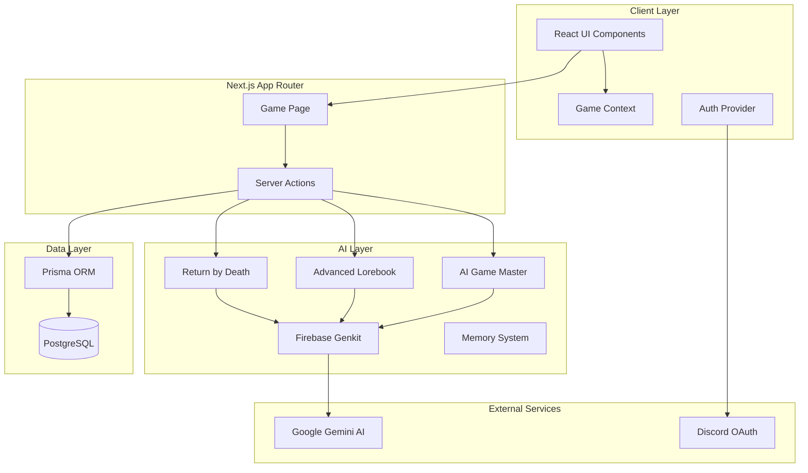
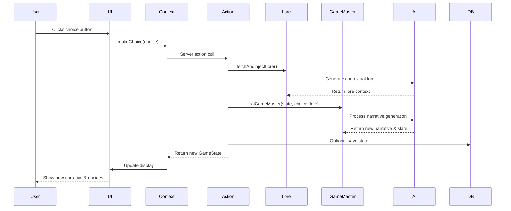
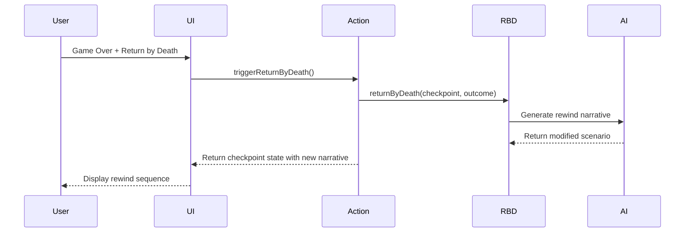
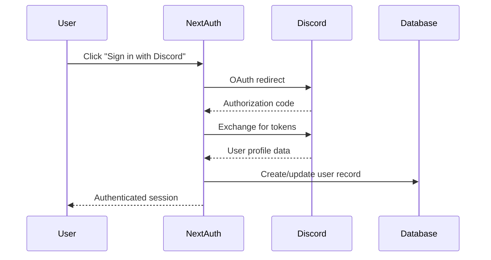

# 🏗️ Architecture Overview

This document provides a comprehensive overview of Natsuki Quest's system architecture, component relationships, and data flow patterns.

## High-Level Architecture

> **TODO**: Convert Mermaid diagram to image for better GitHub compatibility



## Component Overview

### Frontend Architecture

#### 1. React Context System
```typescript
// src/contexts/GameContext.tsx
interface GameContextType {
  gameState: GameState | null;
  isLoading: boolean;
  startNewGame: () => Promise<void>;
  makeChoice: (choice: string) => Promise<void>;
  triggerReturnByDeath: () => Promise<void>;
  saveGame: () => Promise<void>;
  loadGame: () => Promise<void>;
}
```

**Purpose**: Centralized state management for game data
- Manages current game state across components
- Handles loading states and error handling
- Provides unified interface for game actions

#### 2. UI Component Structure
```
src/components/
├── ui/              # Radix UI components (Button, Dialog, etc.)
├── game/            # Game-specific components
│   ├── NarrativeDisplay.tsx
│   ├── CharacterPanel.tsx
│   ├── InventoryDisplay.tsx
│   └── ChoiceButtons.tsx
└── layout/          # Layout components
```

**Design Principles**:
- Radix UI for accessibility and consistency
- Tailwind CSS for styling with custom design tokens
- Lucide React for icons
- Responsive design with mobile-first approach

### Backend Architecture

#### 1. Next.js App Router Structure
```
src/app/
├── page.tsx              # Main game interface
├── layout.tsx            # Root layout with providers
├── globals.css           # Global styles and CSS variables
├── actions.ts            # Server actions for game logic
├── auth-provider.tsx     # NextAuth provider wrapper
├── api/
│   └── auth/            # NextAuth API routes
└── game/
    └── page.tsx         # Dedicated game page (if needed)
```

#### 2. Server Actions Pattern
```typescript
// src/app/actions.ts
'use server';

export async function makeChoice(
  currentState: GameState,
  choice: string
): Promise<GameState> {
  // 1. Fetch relevant lore
  const loreContext = await fetchAndInjectLore({...});
  
  // 2. Process choice through AI Game Master
  const aiResponse = await aiGameMaster({...});
  
  // 3. Update game state
  return newState;
}
```

**Benefits**:
- Type-safe client-server communication
- Automatic serialization/deserialization
- Built-in loading states and error handling
- Server-side authentication checks

### AI System Architecture

#### 1. Firebase Genkit Integration
```typescript
// src/ai/genkit.ts
export const ai = genkit({
  plugins: [googleAI()],
  model: 'googleai/gemini-2.0-flash',
});
```

#### 2. AI Flow Architecture
```
src/ai/flows/
├── ai-game-master.ts      # Main narrative generation
├── advanced-lorebook.ts   # Contextual lore injection
├── return-by-death.ts     # Death/revival mechanics
├── memory-system.ts       # Long-term memory management
├── dynamic-narrative.ts   # Dynamic story adaptation
└── adaptive-encounters.ts # Encounter generation
```

Each flow follows a consistent pattern:
```typescript
interface FlowPattern<Input, Output> {
  inputSchema: z.ZodSchema<Input>;
  outputSchema: z.ZodSchema<Output>;
  prompt: string;
  flow: (input: Input) => Promise<Output>;
}
```

### Data Layer Architecture

#### 1. Prisma Schema Design
```prisma
model User {
  id        String @id @default(cuid())
  // NextAuth fields
  gameSaves GameSave[]
}

model GameSave {
  id     String @id @default(cuid())
  state  Json   // Serialized GameState
  user   User   @relation(fields: [userId], references: [id], onDelete: Cascade)
  userId String
}
```

#### 2. Type System Integration
```typescript
// src/lib/types.ts
export interface GameState {
  narrative: string;
  choices: string[];
  characters: Character[];
  inventory: Item[];
  skills: Skill[];
  currentLoop: number;
  isGameOver: boolean;
  checkpoint: GameState | null;
  lastOutcome: string;
  memory: string;
}
```

## Data Flow Patterns

### 1. Player Choice Sequence Diagram



### 2. Return by Death Flow



### 3. Authentication Flow



## Key Design Decisions

### 1. State Management Strategy

**Choice**: React Context + Server Actions
- **Pros**: Simple, type-safe, built into Next.js
- **Cons**: Not suitable for complex state trees
- **Alternative considered**: Redux Toolkit, Zustand

### 2. AI Integration Approach

**Choice**: Firebase Genkit with structured outputs
- **Pros**: Type-safe AI responses, built-in prompt management
- **Cons**: Vendor lock-in to Google ecosystem
- **Alternative considered**: Direct OpenAI API, Vercel AI SDK

### 3. Database Strategy

**Choice**: PostgreSQL + Prisma with JSON storage for game state
- **Pros**: Flexible schema, type-safe queries, easy migrations
- **Cons**: Less efficient than normalized storage
- **Alternative considered**: MongoDB, normalized SQL schema

### 4. Authentication Provider

**Choice**: NextAuth.js with Discord OAuth
- **Pros**: Well-maintained, multiple provider support
- **Cons**: Complex session management
- **Alternative considered**: Clerk, Auth0

## Performance Considerations

### 1. AI Response Times
- Average Gemini 2.0 Flash response: 2-4 seconds
- Implement optimistic UI updates where possible
- Use streaming responses for long narratives (future enhancement)

### 2. Database Optimization
- Game state stored as JSON for flexibility
- Consider archiving old save states
- Index on userId for fast user data retrieval

### 3. Client-Side Performance
- Code splitting for game components
- Lazy loading of non-critical UI elements
- Image optimization for character avatars

## Security Architecture

### 1. Authentication & Authorization
```typescript
// All server actions require authentication
export async function makeChoice(...) {
  const session = await auth();
  if (!session?.user?.id) {
    throw new Error('Unauthorized');
  }
  // ... action logic
}
```

### 2. Input Validation
- Zod schemas for all AI inputs/outputs
- Server-side validation of user choices
- SQL injection prevention via Prisma

### 3. Rate Limiting
- TODO: Implement rate limiting for AI calls
- Consider user-based quotas for API usage

## Scalability Considerations

### Current Limitations
- Single save slot per user
- No multiplayer support
- Memory system limited to 2000 characters

### Future Enhancements
- Multiple save slots
- Shared story experiences
- Advanced memory compression
- Real-time multiplayer narrative experiences

## Monitoring & Observability

### Development
- Genkit UI for AI flow debugging
- Prisma Studio for database inspection
- Next.js built-in performance monitoring

### Production (TODO)
- Error tracking (Sentry)
- Performance monitoring (Vercel Analytics)
- AI usage metrics
- User engagement analytics

## Related Documentation

- 🛠️ [Setup Guide](setup.md) - Local development environment setup
- 🤖 [AI System](ai-system.md) - Detailed AI flows and prompt engineering
- 🗄️ [Database Schema](database.md) - Data models and relationships
- 🔌 [API Documentation](api.md) - Server actions and endpoints
- 👩‍💻 [Development Guide](development.md) - Coding standards and workflow
- 🚀 [Deployment Guide](deployment.md) - Production deployment

---

This architecture supports the core game loop while maintaining flexibility for future enhancements and scaling requirements.