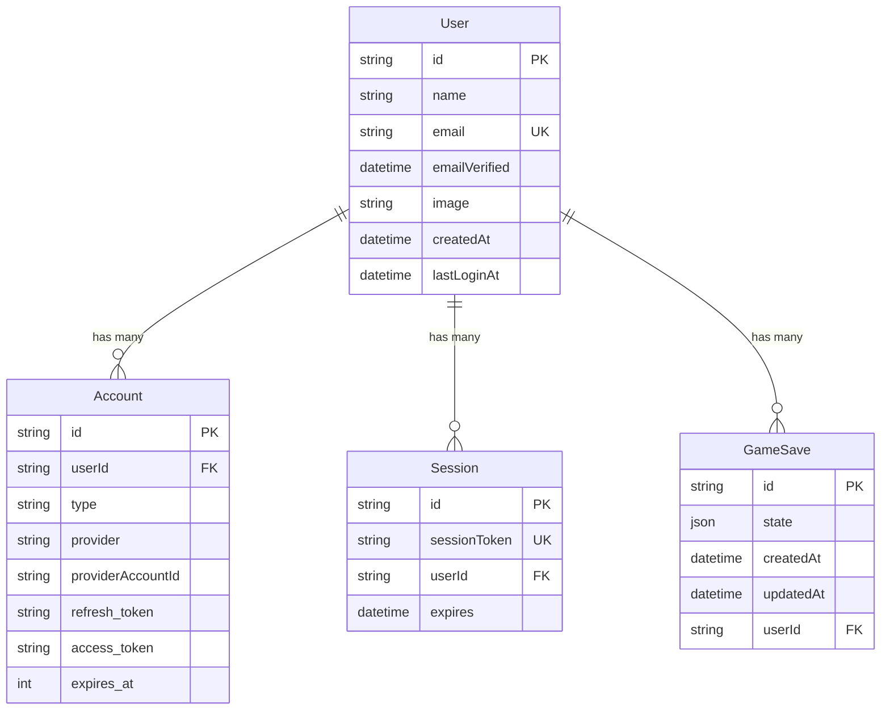

# 🗄️ Database Documentation

This document covers the database schema, relationships, and data management strategies for Natsuki Quest.

## Overview

Natsuki Quest uses PostgreSQL with Prisma ORM for type-safe database operations. The schema is designed to support user authentication via NextAuth.js and flexible game state storage.

## Database Schema

### Complete Prisma Schema

```prisma
// prisma/schema.prisma
generator client {
  provider = "prisma-client-js"
}

datasource db {
  provider = "postgresql"
  url      = env("DATABASE_URL")
}

// Game-specific models
model GameSave {
  id        String   @id @default(cuid())
  state     Json
  createdAt DateTime @default(now())
  updatedAt DateTime @updatedAt
  user      User     @relation(fields: [userId], references: [id], onDelete: Cascade)
  userId    String
  
  // Optional: Add indexes for better performance
  @@index([userId])
  @@index([updatedAt])
}

// NextAuth.js required models
model Account {
  id                String  @id @default(cuid())
  userId            String
  type              String
  provider          String
  providerAccountId String
  refresh_token     String?
  access_token      String?
  expires_at        Int?
  token_type        String?
  scope             String?
  id_token          String?
  session_state     String?

  user User @relation(fields: [userId], references: [id], onDelete: Cascade)

  @@unique([provider, providerAccountId])
  @@index([userId])
}

model Session {
  id           String   @id @default(cuid())
  sessionToken String   @unique
  userId       String
  expires      DateTime
  user         User     @relation(fields: [userId], references: [id], onDelete: Cascade)
  
  @@index([userId])
}

model User {
  id            String    @id @default(cuid())
  name          String?
  email         String?   @unique
  emailVerified DateTime?
  image         String?
  accounts      Account[]
  sessions      Session[]
  gameSaves     GameSave[]
  
  // Optional: User preferences
  createdAt     DateTime  @default(now())
  lastLoginAt   DateTime?
}

model VerificationToken {
  identifier String
  token      String   @unique
  expires    DateTime

  @@unique([identifier, token])
}
```

## Model Explanations

### 1. GameSave Model

**Purpose**: Stores serialized game state for each user

```typescript
interface GameSaveData {
  id: string;           // Unique identifier (cuid)
  state: GameState;     // JSON serialized game state
  createdAt: Date;      // When save was created
  updatedAt: Date;      // Last modification time
  userId: string;       // Foreign key to User
}
```

**Design Decisions**:
- **JSON Storage**: Game state stored as JSON for flexibility
- **Single Save Slot**: One save per user (can be extended)
- **Automatic Timestamps**: Created/updated timestamps for debugging
- **Cascade Delete**: Game saves deleted when user is deleted

**Game State Structure**:
```typescript
// What gets stored in the 'state' JSON field
interface GameState {
  narrative: string;           // Current story text
  choices: string[];          // Available player choices
  characters: Character[];    // All game characters and relationships
  inventory: Item[];          // Player's items
  skills: Skill[];           // Player's abilities
  currentLoop: number;        // Return by Death loop counter
  isGameOver: boolean;        // Death/ending state
  checkpoint: GameState | null; // Last checkpoint for Return by Death
  lastOutcome: string;        // Result of last choice
  memory: string;             // Compressed event history
}
```

### 2. User Model (Extended from NextAuth)

**Standard NextAuth Fields**:
- `id`: Primary key (cuid format for uniqueness)
- `name`: User's display name from Discord
- `email`: User's email (may be null if Discord doesn't provide)
- `emailVerified`: Email verification status
- `image`: Profile avatar URL from Discord

**Custom Extensions**:
- `createdAt`: Account creation timestamp
- `lastLoginAt`: Track user activity (optional implementation)

### 3. Account Model (NextAuth OAuth)

**Purpose**: Stores OAuth provider information

```typescript
interface AccountData {
  id: string;
  userId: string;           // Links to User
  type: "oauth";           // Account type
  provider: "discord";     // OAuth provider
  providerAccountId: string; // Discord user ID
  refresh_token?: string;   // For token refresh
  access_token?: string;    // Current access token
  expires_at?: number;      // Token expiration
  // ... other OAuth fields
}
```

### 4. Session Model (NextAuth)

**Purpose**: Manages user sessions

```typescript
interface SessionData {
  id: string;
  sessionToken: string;     // Unique session identifier
  userId: string;          // Links to User
  expires: Date;           // Session expiration
}
```

## Relationships and Constraints

### Entity Relationship Diagram



### Cascading Deletes

**User Deletion Flow**:
```sql
-- When a user is deleted, all related data is automatically removed
DELETE FROM "User" WHERE id = 'user123';

-- Triggers automatic deletion of:
-- 1. All Account records for this user
-- 2. All Session records for this user  
-- 3. All GameSave records for this user
```

**Benefits**:
- Data consistency guaranteed
- No orphaned records
- GDPR compliance (complete user data removal)

## Common Query Patterns

### 1. User Authentication Queries

```typescript
// Find user by email (NextAuth)
const user = await prisma.user.findUnique({
  where: { email: 'user@example.com' },
  include: {
    accounts: true,
    sessions: true,
  }
});

// Find user by OAuth account
const user = await prisma.user.findFirst({
  where: {
    accounts: {
      some: {
        provider: 'discord',
        providerAccountId: 'discord123'
      }
    }
  }
});
```

### 2. Game Save Operations

```typescript
// Load user's most recent game save
const gameSave = await prisma.gameSave.findUnique({
  where: { userId: 'user123' }
});

// Create or update save (upsert pattern)
const savedGame = await prisma.gameSave.upsert({
  where: { userId: session.user.id },
  update: { state: newGameState },
  create: {
    userId: session.user.id,
    state: newGameState
  }
});

// Get save with user info
const saveWithUser = await prisma.gameSave.findUnique({
  where: { id: 'save123' },
  include: { user: true }
});
```

### 3. Analytics Queries

```typescript
// Count total users
const userCount = await prisma.user.count();

// Count active users (with saves)
const activeUsers = await prisma.user.count({
  where: {
    gameSaves: {
      some: {}
    }
  }
});

// Recent activity
const recentSaves = await prisma.gameSave.findMany({
  where: {
    updatedAt: {
      gte: new Date(Date.now() - 24 * 60 * 60 * 1000) // Last 24 hours
    }
  },
  include: { user: true },
  orderBy: { updatedAt: 'desc' }
});
```

## Migration Strategy

### Initial Migration

```bash
# Create initial migration
npx prisma migrate dev --name init

# Generated SQL will include:
# - All table creation statements
# - Indexes for performance
# - Foreign key constraints
# - Default values
```

### Schema Evolution

```bash
# Example: Adding user preferences
# 1. Update schema.prisma
model User {
  // ... existing fields
  preferences Json?  @default("{}")
}

# 2. Create migration
npx prisma migrate dev --name add_user_preferences

# 3. Prisma generates SQL:
# ALTER TABLE "User" ADD COLUMN "preferences" JSONB DEFAULT '{}';
```

### Migration Best Practices

1. **Always backup** production data before migrations
2. **Test migrations** on development data first
3. **Use descriptive names** for migration files
4. **Review generated SQL** before applying to production

## Data Seeding

### Development Seed Script

```typescript
// prisma/seed.ts
import { PrismaClient } from '@prisma/client';
import { initialGameState } from '../src/lib/initial-game-state';

const prisma = new PrismaClient();

async function main() {
  // Create test user
  const testUser = await prisma.user.upsert({
    where: { email: 'test@example.com' },
    update: {},
    create: {
      email: 'test@example.com',
      name: 'Test Player',
      image: 'https://placehold.co/100x100.png'
    }
  });

  // Create sample game save
  await prisma.gameSave.upsert({
    where: { userId: testUser.id },
    update: { state: initialGameState },
    create: {
      userId: testUser.id,
      state: initialGameState
    }
  });

  console.log('Database seeded successfully');
}

main()
  .catch(console.error)
  .finally(() => prisma.$disconnect());
```

**Run Seeding**:
```bash
# Add to package.json
"prisma": {
  "seed": "tsx prisma/seed.ts"
}

# Execute seeding
npx prisma db seed
```

## Performance Optimization

### 1. Indexing Strategy

```prisma
model GameSave {
  // ... fields
  
  @@index([userId])        // Fast user save lookups
  @@index([updatedAt])     // Recent activity queries
}

model Account {
  // ... fields
  
  @@index([userId])        // User account lookups
  @@unique([provider, providerAccountId]) // OAuth uniqueness
}

model Session {
  // ... fields
  
  @@index([userId])        // User session queries
}
```

### 2. Query Optimization

```typescript
// ✅ Good: Select only needed fields
const user = await prisma.user.findUnique({
  where: { id: userId },
  select: {
    id: true,
    name: true,
    gameSaves: { select: { state: true, updatedAt: true } }
  }
});

// ❌ Bad: Loading all data
const user = await prisma.user.findUnique({
  where: { id: userId },
  include: { gameSaves: true, accounts: true, sessions: true }
});
```

### 3. Connection Pooling

```typescript
// src/lib/prisma.ts
import { PrismaClient } from '@prisma/client';

const globalForPrisma = globalThis as unknown as {
  prisma: PrismaClient | undefined;
};

export const prisma = globalForPrisma.prisma ?? new PrismaClient({
  log: ['query'], // Enable query logging in development
});

if (process.env.NODE_ENV !== 'production') {
  globalForPrisma.prisma = prisma;
}
```

## Backup and Recovery

### Automated Backups (Production)

```bash
# PostgreSQL dump
pg_dump $DATABASE_URL > backup_$(date +%Y%m%d_%H%M%S).sql

# Compressed backup
pg_dump $DATABASE_URL | gzip > backup_$(date +%Y%m%d_%H%M%S).sql.gz
```

### Data Recovery

```bash
# Restore from backup
psql $DATABASE_URL < backup_20240101_120000.sql

# Or from compressed backup
gunzip -c backup_20240101_120000.sql.gz | psql $DATABASE_URL
```

## Security Considerations

### 1. SQL Injection Prevention

Prisma automatically prevents SQL injection through:
- Parameterized queries
- Type-safe query building
- Input sanitization

```typescript
// ✅ Safe: Prisma handles parameterization
const user = await prisma.user.findMany({
  where: { name: { contains: userInput } }
});

// ❌ Dangerous: Raw SQL (avoid unless necessary)
const users = await prisma.$queryRaw`
  SELECT * FROM User WHERE name LIKE '%${userInput}%'
`;
```

### 2. Data Privacy

```typescript
// Remove sensitive data from game saves
function sanitizeGameState(state: GameState): GameState {
  return {
    ...state,
    // Remove any potentially sensitive user data
    memory: state.memory.replace(/email|password|token/gi, '[REDACTED]')
  };
}
```

### 3. Access Control

```typescript
// Always verify user ownership
export async function loadGame(userId: string) {
  const save = await prisma.gameSave.findUnique({
    where: { userId }  // Ensures user can only access their own saves
  });
  
  if (!save) {
    throw new Error('Game save not found or access denied');
  }
  
  return save;
}
```

## Monitoring and Maintenance

### 1. Query Performance Monitoring

```typescript
// Add query logging in development
const prisma = new PrismaClient({
  log: [
    { emit: 'event', level: 'query' },
    { emit: 'stdout', level: 'error' },
    { emit: 'stdout', level: 'warn' },
  ],
});

prisma.$on('query', (e) => {
  console.log('Query: ' + e.query);
  console.log('Duration: ' + e.duration + 'ms');
});
```

### 2. Database Health Checks

```typescript
// Health check endpoint
export async function checkDatabaseHealth() {
  try {
    await prisma.$queryRaw`SELECT 1`;
    return { status: 'healthy', timestamp: new Date() };
  } catch (error) {
    return { status: 'unhealthy', error: error.message };
  }
}
```

## Future Enhancements

### Potential Schema Extensions

```prisma
// Multiple save slots
model GameSave {
  // ... existing fields
  slotNumber Int     @default(1)
  name       String? // User-defined save name
  
  @@unique([userId, slotNumber])
}

// User statistics
model UserStats {
  id            String @id @default(cuid())
  userId        String @unique
  totalPlayTime Int    @default(0) // in minutes
  deathCount    Int    @default(0)
  choicesMade   Int    @default(0)
  user          User   @relation(fields: [userId], references: [id])
}

// Shared story experiences (multiplayer)
model SharedStory {
  id          String @id @default(cuid())
  title       String
  description String?
  state       Json
  createdBy   String
  participants String[] // Array of user IDs
  isPublic    Boolean  @default(false)
  creator     User     @relation(fields: [createdBy], references: [id])
}
```

## Related Documentation

- 🏗️ [Architecture Overview](architecture.md) - How the database fits into the overall system
- 🔌 [API Documentation](api.md) - Server actions that interact with the database
- 🛠️ [Setup Guide](setup.md) - Database setup and configuration
- 👩‍💻 [Development Guide](development.md) - Database development workflow
- 🚀 [Deployment Guide](deployment.md) - Production database hosting options

## External Resources

- [Prisma Documentation](https://www.prisma.io/docs/) - Complete ORM documentation
- [PostgreSQL Documentation](https://www.postgresql.org/docs/) - Database engine reference
- [NextAuth.js Schema](https://next-auth.js.org/adapters/prisma) - Authentication schema reference

---

This database design balances simplicity with flexibility, supporting the current game features while allowing for future enhancements.